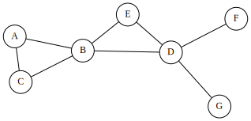
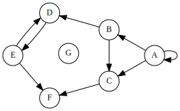
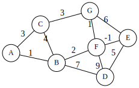
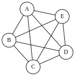
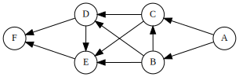
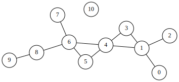

# Graph

## Type of Graph

- Undirected Graph

  

- Directed Graph (Digraph)

  

- Weighted Graph

  

- Complete Graph

  

- Directed Acyclic Graph (DAG)

  

- Tree (undirected graph with no cycles)
- Bipartite Graph

## Representing Graphs



Notice that the following examples are not optimized. Since the sample tree is undirected and unweighted, there should be several choices for optimization.

### Adjacency Matrix

```c
bool matrix[11][11] = {
//  0  1  2  3  4  5  6  7  8  9  10
  { 0, 1, 0, 0, 0, 0, 0, 0, 0, 0, 0 }, // 0
  { 1, 0, 1, 1, 1, 0, 0, 0, 0, 0, 0 }, // 1
  { 0, 1, 0, 0, 0, 0, 0, 0, 0, 0, 0 }, // 2
  { 0, 1, 0, 0, 1, 0, 0, 0, 0, 0, 0 }, // 3
  { 0, 1, 0, 1, 0, 1, 1, 0, 0, 0, 0 }, // 4
  { 0, 0, 0, 0, 1, 0, 1, 0, 0, 0, 0 }, // 5
  { 0, 0, 0, 0, 1, 1, 0, 1, 1, 0, 0 }, // 6
  { 0, 0, 0, 0, 0, 0, 1, 0, 0, 0, 0 }, // 7
  { 0, 0, 0, 0, 0, 0, 1, 0, 0, 1, 0 }, // 8
  { 0, 0, 0, 0, 0, 0, 0, 0, 1, 0, 0 }, // 9
  { 0, 0, 0, 0, 0, 0, 0, 0, 0, 0, 0 }, // 10
};
```

- Pros
  - Simple
  - Space efficient for dense graphs
  - Edge weight lookup is O(1)
- Cons
  - Require O(V^2) space
  - Take O(V^2) to traverse all edges

### Adjacency List

```cpp
[0]: [1]
[1]: [2] -> [3] -> [4]
[2]: [1]
[3]: [1] -> [4]
[4]: [1] -> [3] -> [5] -> [6]
[5]: [4] -> [6]
[6]: [4] -> [5] -> [7] -> [8]
[7]: [6]
[8]: [6] -> [9]
[9]: [8]
// node 10 is not connected to any node
```

```cpp
#include <iostream>
#include <list>
#include <algorithm> // find()
using namespace std;

class Graph
{
public:
    Graph(int v);
    void add(int src, int v);
    void print();
private:
    int v;
    list<int> *l;
};

Graph::Graph(int v)
{
    this->v = v;
    this->l = NULL;
    if (v > 0)
    {
        this->v = v;
        this->l = new list<int>[v];
    }
}

void Graph::add(int src, int v)
{
    if (src > this->v || v > this->v)
        return;

    auto i = find(this->l[src].begin(), this->l[src].end(), v);
    if (i != this->l[src].end())
        cout << "[warning] duplicated connection: skip!" << endl;
    else
        this->l[src].push_back(v);
}

void Graph::print()
{
    for (int i=0; i<this->v; i++)
    {
        cout << "[" << i << "]: ";
        for (auto j=this->l[i].begin(); j!=this->l[i].end(); j++)
        {
            cout << "[" << *j << "]";
            if (j != --this->l[i].end())
                cout << " -> ";
        }
        cout << endl;
    }
}

int main()
{
    Graph g(10);
    g.add(0, 1);
    g.add(1, 2); g.add(1, 3); g.add(1, 4);
    g.add(2, 1);
    g.add(3, 1); g.add(3, 4);
    g.add(4, 1); g.add(4, 3); g.add(4, 5); g.add(4, 6);
    g.add(5, 4); g.add(5, 6);
    g.add(6, 4); g.add(6, 5);g.add(6, 7); g.add(6, 8);
    g.add(7, 6);
    g.add(8, 6); g.add(8, 9);
    g.add(9, 8);
    // node 10 is no connected to any node

    g.print();
    return 0;
}
```

### Edge List

```text
[[0,1], [1,2], [1,3], [1,4], [2,1], [3,1], [3,4], [4,1], [4,3], [4,5], [4,6], [5,4], [5,6], [6,4], [6,5], [6,7], [6,8], [7,6], [8,6], [8,9], [9,8]]
```

```cpp
#include <iostream>
#include <list>
#include <vector>
using namespace std;

int main()
{
    list< vector<int> > edges;
    // g++ -std=c++11
    edges.push_back({0, 1});
    edges.push_back({1, 2}); edges.push_back({1, 3}); edges.push_back({1, 4});
    edges.push_back({2, 1});
    edges.push_back({3, 1}); edges.push_back({3, 4});
    edges.push_back({4, 1}); edges.push_back({4, 3}); edges.push_back({4, 5}); edges.push_back({4, 6});
    edges.push_back({5, 4}); edges.push_back({5, 6});
    edges.push_back({6, 4}); edges.push_back({6, 5}); edges.push_back({6, 7}); edges.push_back({6, 8});
    edges.push_back({7, 6});
    edges.push_back({8, 6}); edges.push_back({8, 9});
    edges.push_back({9, 8});
    cout << "[";
    for (auto i=edges.begin(); i!=edges.end(); i++)
    {
        cout << "[" << (*i)[0] << "," << (*i)[1] << "]";
        if (i != --edges.end())
            cout << ", ";
    }
    cout << "]" << endl;
    return 0;
}
```

## Traversing Graphs

Let's continue using the undirected graph in [Representing Graphs](#Representing\ Graphs) section for demenstration.

### Depth First Search (DFS)

- Time complexity: O(V+E)

Using the [Adjacency List](#Adjacency\ List) in the previous section: 

```c
class Graph
{
public:
    Graph(int v);
    void add(int src, int v);
    void print();
private:
    int v;
    list<int> *l; 
    bool *visited; // <-- add this property
};
```

### Breadth First Search (BFS)

- Time complexity: O(V+E)

## Common Problems

### Shortest Path Problem

- BFS, Dijkstra's, Bellman-Ford, Floyd-Warshall, A*

### Connectivity

- Union find data structure, DFS, BFS

### Negtive cycles

- Bellman-Ford, Floyd-Warshall

### Strongly Connected Components

- Tarjan's and Kosaraju's algorithm

### Traveling Salesman Problem

- Held-Karp, 

### Bridges

### Minimum Spanning Tree (MST)

### Network Flow: Max Flow
